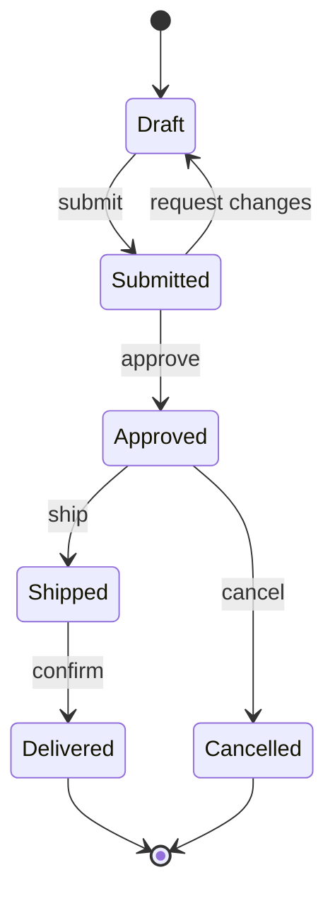

# Order Lifecycle

State diagrams make the rules obvious.

```mermaid
stateDiagram-v2
    [*] --> Draft
    Draft --> Submitted: submit
    Submitted --> Approved: approve
    Submitted --> Draft: request changes
    Approved --> Shipped: ship
    Shipped --> Delivered: confirm
    Delivered --> [*]
    Approved --> Cancelled: cancel
    Cancelled --> [*]
```
