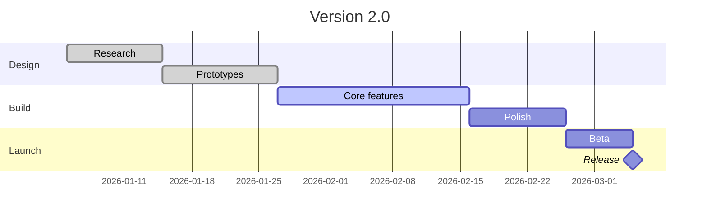

# Release Plan

Plan the work, then share it — Gantt charts render right in your notes.

## Milestones

1. **Design complete** — prototypes signed off
2. **Feature freeze** — only fixes after this point
3. **Release** — ship it
