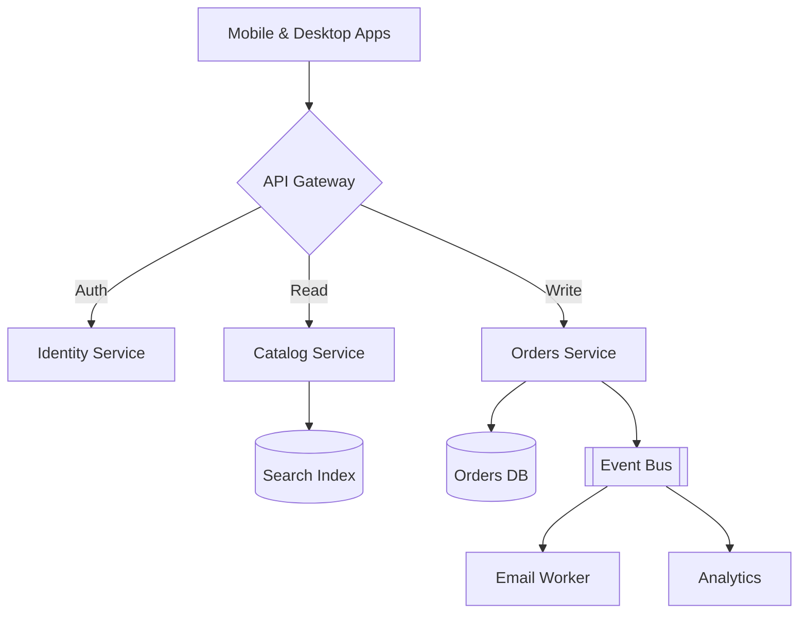

# System Architecture

How a request travels from the app to storage — rendered live from a Mermaid block.

## Notes

- The gateway terminates TLS and routes by path.
- Orders publish events so downstream work never blocks checkout.
