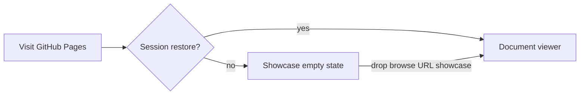

# Spec: Web showcase homepage

**Date:** 2026-08-20
**Surface:** GitHub Pages web app only (`https://cbremer.github.io/specdown`)
**Out of scope:** separate marketing domain, second Vite app, auto-opening a
`welcome.md` tab, App Store badges, changing the desktop or iOS empty state.

---

## Problem

The hosted app _is_ the website. On first visit you saw “Drop Markdown File
Here” with no Open Graph tags, so a LinkedIn unfurl did not show the Mermaid
aha and did not read as a product.

---

## Decision

Upgrade the **web empty state** into a product showcase. Desktop and iOS keep
the compact drop-zone. Returning web users who restore a session never see the
landing.

The viewer does not go away. Drop, browse, Open Folder (Chromium), paste a URL,
paste a GitHub repo, and **Try diagram showcase** all open documents in the
same tabbed viewer as before.

---

## Empty-state contents (web)

- **Hero:** one-liner and lede from the feature copy spec.
- **Drop card:** existing drop / browse / Open Folder affordance, still the
  primary way to open a local file.
- **Try diagram showcase:** fetches bundled `samples/diagram-showcase.md` (the
  iOS sample buttons stay iOS-native via the WKWebView bridge).
- **Live Mermaid:** one canned architecture diagram rendered with the same
  lazy Mermaid + expand-to-fullscreen path as document diagrams. Skipped when
  the host has no layout box (jsdom / tests) so init stays side-effect free.
- **Three pillars:** Present diagrams / Open from anywhere / Read, don’t edit.
- **Desktop CTA:** link to the latest GitHub Release.
- **Kept:** URL field, recents, drag-and-drop overlay.

Click-to-browse ignores links, buttons, inputs, the hero, pillars, download
block, sample actions, recents, URL field, and diagram chrome so those controls
do not open the file picker.

---

## Social unfurl

`index.html` carries Open Graph + Twitter tags. `og:image` is a 1200×630 PNG
at `markdown-viewer/public/og-image.png` (Vite copies it to `dist/`). Absolute
URLs point at `https://cbremer.github.io/specdown/`.

---

## Implementation map

| Piece          | Where                                                                  |
| -------------- | ---------------------------------------------------------------------- |
| Markup         | `markdown-viewer/index.html` (`#landing-*`, `#web-sample-section`)     |
| Behavior       | `markdown-viewer/src/features/landing.js`                              |
| Diagram render | `renderStandaloneMermaid()` in `features/diagrams.js`                  |
| Styles         | `.drop-zone.web-showcase` block in `styles.css` (no whole-file format) |
| Tests          | `tests/unit/landing.test.js`                                           |
