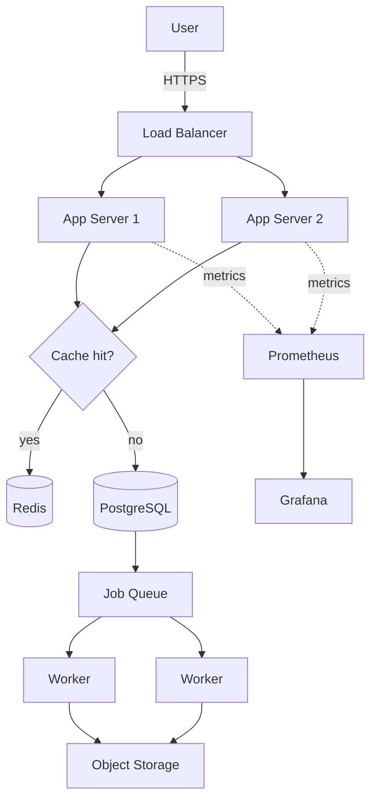
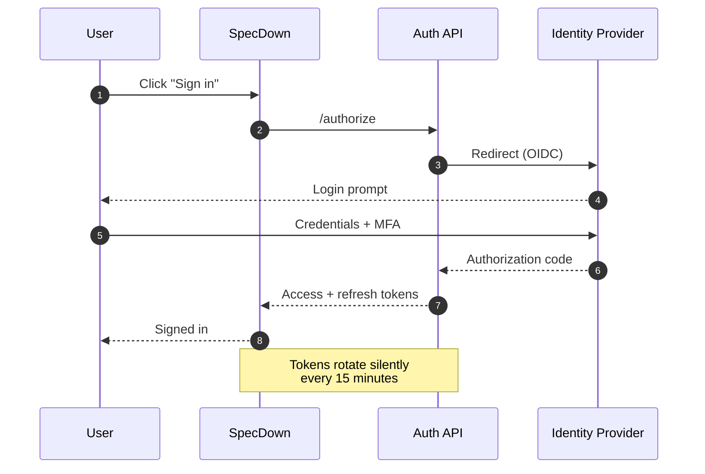
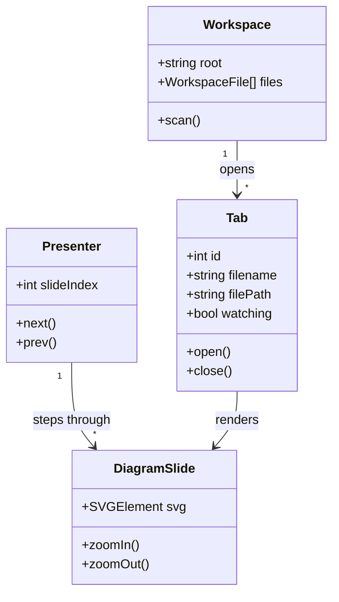
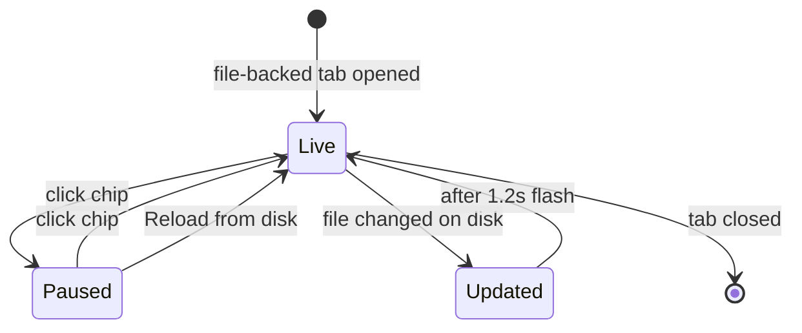
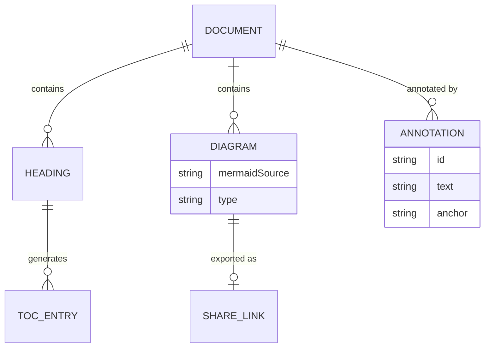
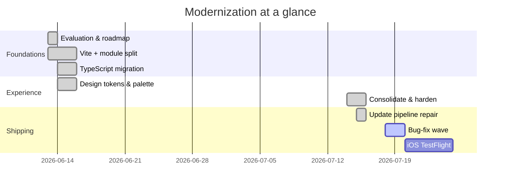
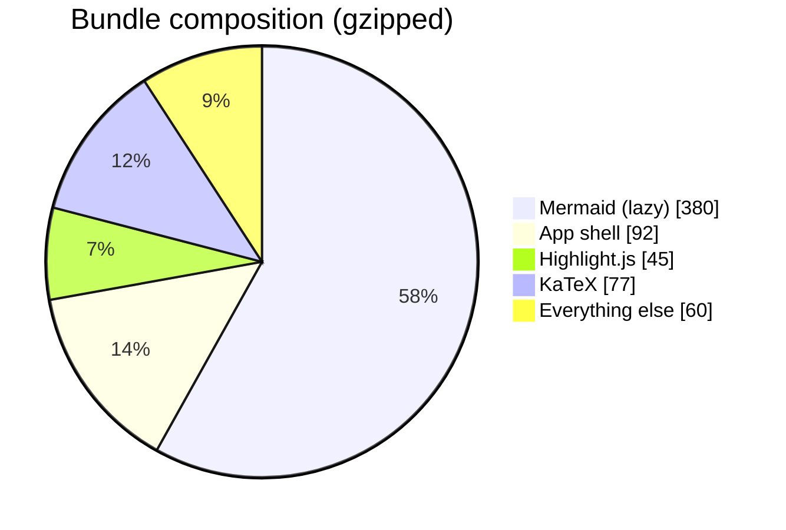
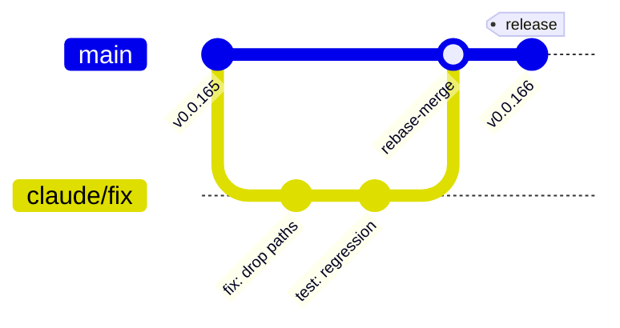
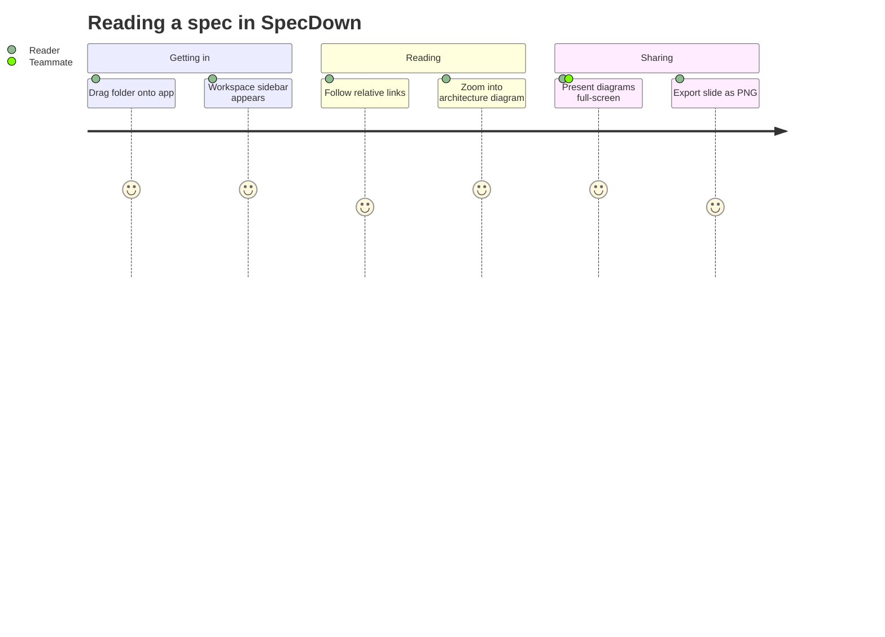
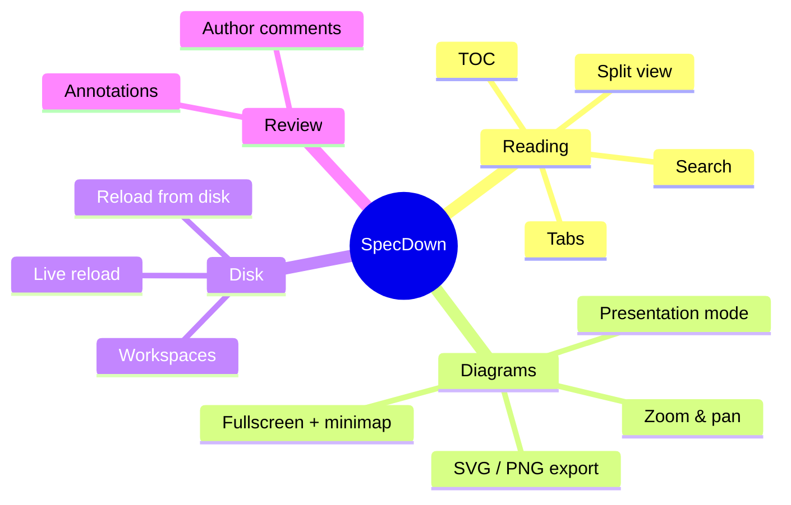

# Diagram Showcase

A test document packed with **every major Mermaid diagram type** — handy for
exercising SpecDown's diagram features: inline diagrams that expand into a
fullscreen explorer with zoom/pan, minimap, SVG/PNG export, and share links,
plus theme re-rendering and **presentation mode** (hit *Present* and step
through with `←` / `→`).

Between the diagrams there's ordinary markdown — headings for the table of
contents, a table, and a code block — so this file also works as a general
smoke-test document.

---

## 1. Flowchart — system architecture

The classic. Expand it to zoom, pan, and explore.



## 2. Sequence diagram — auth flow



## 3. Class diagram — viewer internals



## 4. State diagram — live reload chip

The actual state machine behind the "Live" chip next to the filename.



## 5. Entity relationship — content model



## 6. Gantt — release timeline



## 7. Pie — where the bytes live



## 8. Git graph — merge discipline



## 9. User journey — opening a spec



## 10. Mindmap — feature map



---

## Non-diagram content

A table, for rendering sanity:

| Feature | Surface | Shortcut |
| --- | --- | --- |
| Command palette | All | `Cmd/Ctrl + K` |
| Present diagrams | All | — |
| Live reload | Desktop | chip click |

And a code block, for highlight + copy-button testing:

```javascript
export function hasPresentableDiagrams() {
  // Scoped to the wrapper — the controls' icon SVGs don't count.
  return collectDiagrams().length > 0;
}
```

<!-- This authored HTML comment tests the Comments toggle. -->

*End of showcase — ten diagrams, one of each flavor.*
