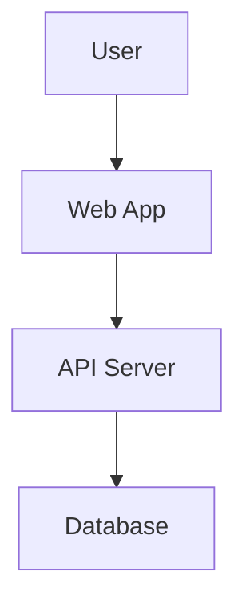
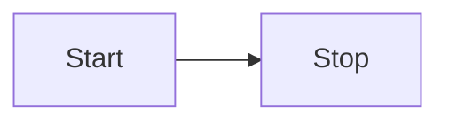

# Document with Mermaid Diagram

This document is bundled with SpecDown so the iOS app always ships with a Mermaid test file.

## System Architecture

```mermaid
graph TD
    A[User] --> B[Web App]
    B --> C[API Server]
    C --> D[Database]
```

## Another Diagram

```mermaid
flowchart LR
    Start --> Stop
```
